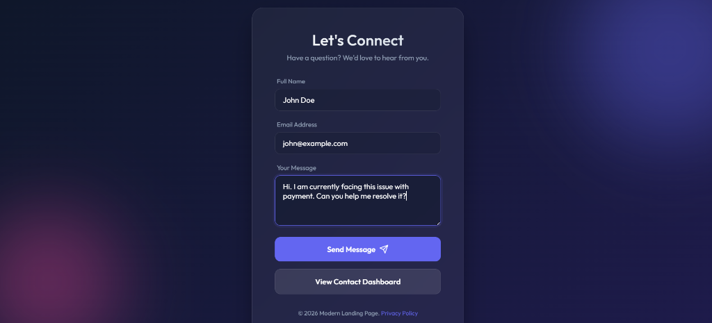
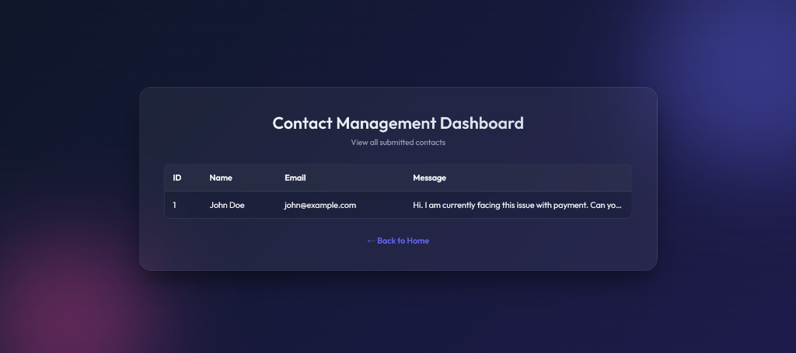
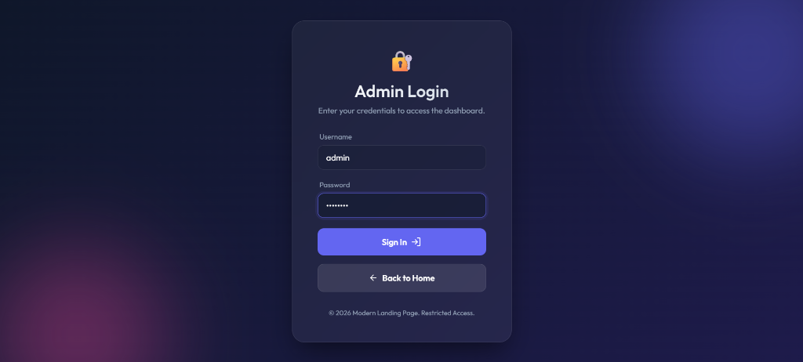

# Modern Landing Page & Secure Admin Dashboard 🚀

> A full-stack, responsive "Contact Us" landing page featuring a glassmorphism UI, form handling, and a secure admin dashboard built with **Spring Boot**, **Thymeleaf**, **Spring Security**, and **MySQL**.

---

## 📸 Social Preview

| Landing Page | Admin Dashboard |
|---|---|
|  |  |

## 📸 Security Features Preview

| Login Page |
|---|
|  |


---

## ✨ Features

| Feature | Description |
|---|---|
| 🎨 **Glassmorphism UI** | Dark-mode design with animated blobs, blur effects, and smooth transitions |
| 📬 **Contact Form** | Full-stack form handling with Spring MVC and `RedirectAttributes` flash messages |
| 🗄️ **MySQL Persistence** | Saves submissions to a relational database via Spring Data JPA |
| ✅ **Success / Error Alerts** | Real-time animated feedback after form submission |
| 🔒 **Spring Security Authentication** | Protects dashboard and contacts API behind a login page |
| 🛡️ **Role-Based Access Control** | Only users with `ADMIN` role can access sensitive data routes |
| 🔑 **BCrypt Hashing** | Secure password storage using BCrypt encoder |
| 🔒 **Credential Safety** | Database secrets are loaded from **environment variables** — never hard-coded |

---

## 🛠️ Tech Stack

| Layer | Technology |
|---|---|
| **Language** | Java 21 |
| **Framework** | Spring Boot 4.0.3 |
| **Security** | Spring Security 6+ |
| **Template Engine** | Thymeleaf |
| **Persistence** | Spring Data JPA + Hibernate |
| **Database** | MySQL 8+ |
| **Build Tool** | Maven (with Maven Wrapper) |
| **Frontend** | HTML5 · CSS3 (Vanilla, Glassmorphism) |
| **Font** | Google Fonts — Outfit |

---

## 📁 Project Structure

```
Modern-Contact-Form-Web-App-Spring-Boot-Thymeleaf-MySQL/
├── src/
│   ├── main/
│   │   ├── java/com/internship/landingpage/
│   │   │   ├── LandingpageApplication.java   # Spring Boot entry point
│   │   │   ├── Contact.java                  # JPA Entity
│   │   │   ├── ContactController.java        # MVC Controller (GET / + POST /submit)
│   │   │   └── ContactRepository.java        # Spring Data JPA Repository
│   │   └── resources/
│   │       ├── application.properties        # ⚠️ Git-ignored — local only
│   │   │   ├── ...
│   │   │   ├── SecurityConfig.java           # Spring Security configurations
│   │   │   ├── User.java                     # User JPA Entity for authentication
│   │   │   ├── UserRepository.java           # Repository for users
│   │   │   ├── CustomUserDetailsService.java # Service to load user by username
│   │   │   ├── DataSetupRunner.java          # Injects initial admin user
│   │   │   └── ...
│   └── test/
├── pom.xml
└── README.md
```

---

## ⚙️ Prerequisites

- **Java 21+** — [Download](https://adoptium.net/)
- **Maven 3.9+** — or use the included `mvnw` wrapper
- **MySQL 8+** — running locally or remotely

---

## 🏁 Getting Started

### 1. Clone the repository

```bash
git clone https://github.com/garry-18/Modern-Contact-Form-Web-App-Spring-Boot-Thymeleaf-MySQL.git
cd Modern-Contact-Form-Web-App-Spring-Boot-Thymeleaf-MySQL
```

### 2. Create the MySQL database

```sql
CREATE DATABASE internship_db;
```

> See [`DATABASE_SETUP.sql`](DATABASE_SETUP.sql) for the full schema.

### 3. Configure credentials

Copy the example config and fill in your database credentials:

```bash
# Windows
copy src\main\resources\application.properties.example src\main\resources\application.properties

# macOS / Linux
cp src/main/resources/application.properties.example src/main/resources/application.properties
```

Then **either** edit `application.properties` to set literal values *(local dev only)*:

```properties
spring.datasource.username=root
spring.datasource.password=yourpassword
```

**or** (recommended) set environment variables and leave the placeholders:

```bash
# Windows PowerShell
$env:DB_USERNAME = "root"
$env:DB_PASSWORD = "yourpassword"

# macOS / Linux / Git Bash
export DB_USERNAME=root
export DB_PASSWORD=yourpassword
```

### 4. Run the application

```bash
# Using Maven Wrapper (no Maven installation needed)
./mvnw spring-boot:run        # macOS / Linux
.\mvnw.cmd spring-boot:run    # Windows
```

### 5. Open in your browser

```
http://localhost:8080
```

---

## 🔌 API Endpoints

| Method | Path | Description | Access |
|---|---|---|---|
| `GET` | `/` | Renders the landing page | Public |
| `POST` | `/submit` | Handles contact form submission | Public |
| `GET` | `/login` | Built-in Spring Security login form | Public |
| `POST` | `/logout` | Invalidates session and clears context | Public |
| `GET` | `/contacts` | Returns all contacts as JSON | **ADMIN ONLY** |
| `GET` | `/dashboard` | View all submitted contacts in a table | **ADMIN ONLY** |

---

## 🔑 Admin Credentials
On the first application run, a default `ADMIN` user is injected into the database:
- **Username:** `admin`
- **Password:** `admin123`

---

## 🔒 Security Note

`application.properties` is **excluded from Git** via `.gitignore`.  
Always use `application.properties.example` as the template — it uses environment variable placeholders (`${DB_USERNAME}`, `${DB_PASSWORD}`) so no real credentials are ever committed.

---

<p align="center">Made with ❤️ during internship at <strong>Maincrafts Technology</strong></p>